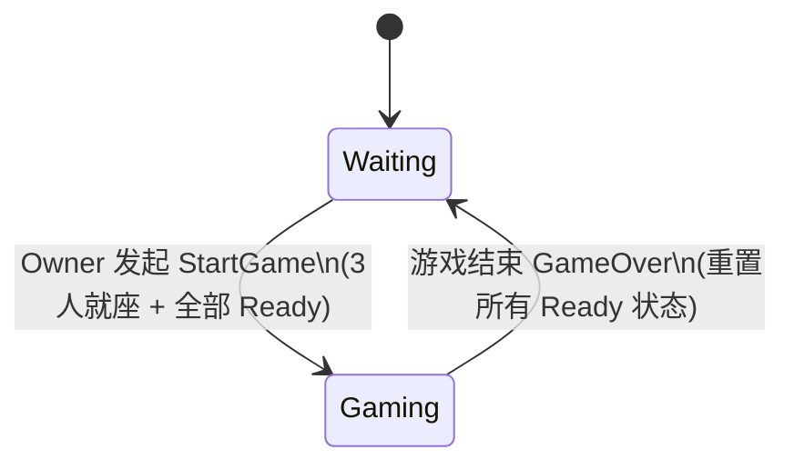
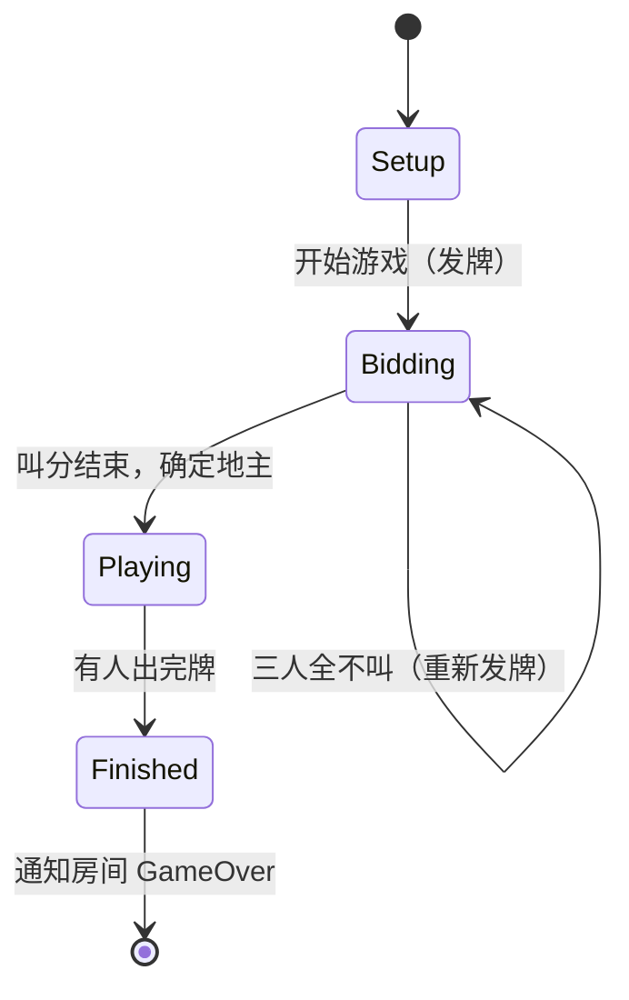
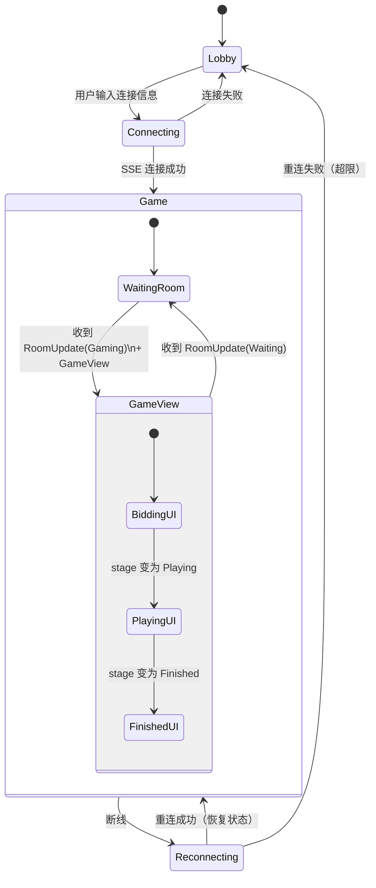
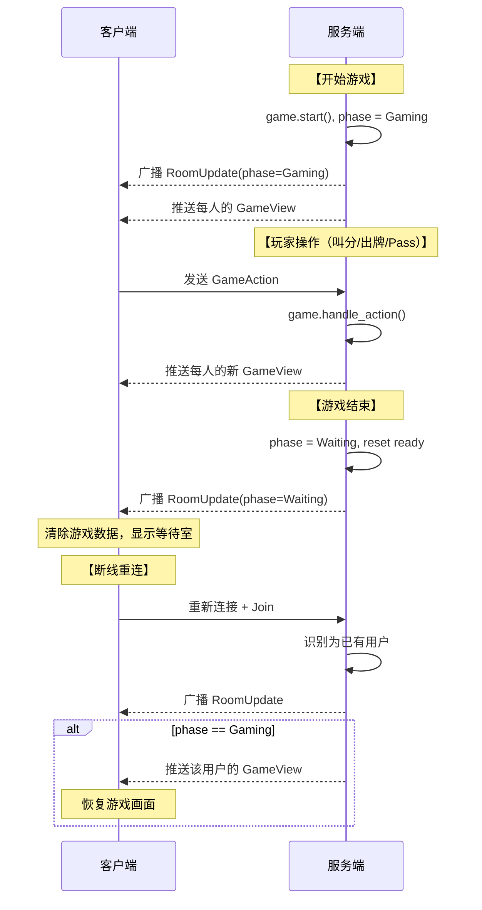

# 斗地主状态机设计文档

## 概述

斗地主是经典的三人扑克牌游戏。本文档描述游戏的完整状态机，涵盖两个层面：

- **房间阶段**（Room Phase）— 管理"等待/游戏中"的生命周期
- **游戏阶段**（Game Stage）— 管理叫分、出牌、结算的游戏内流程

以及客户端如何根据这两层状态决定展示什么。

---

## 一、房间阶段 FSM（Room Phase）

房间是玩家聚集和游戏进行的容器。房间有两个阶段：

### 状态

| 状态 | 含义 |
|------|------|
| `Waiting` | 玩家入座、准备、等待开始 |
| `Gaming` | 游戏正在进行中 |

### 转换



### 操作准入矩阵（Phase Guard）

不同房间操作在不同阶段的合法性：

| 操作 | Waiting | Gaming | 说明 |
|------|---------|--------|------|
| 加入（新用户） | ✅ 成为观察者 | ✅ 成为观察者 | |
| 加入（已有用户=重连） | ✅ 推送房间状态 | ✅ 推送房间状态 + **游戏视图** | 重连必须恢复完整游戏画面 |
| 离开 | ✅ 移除座位 | ✅ 仅标记断连（保留座位） | 游戏中不能移除参与者 |
| 聊天 | ✅ | ✅ | |
| 换座 | ✅ | ❌ 拒绝 | |
| 切换 Ready | ✅ | ❌ 拒绝 | |
| 开始游戏 | ✅（需前置条件） | ❌ 拒绝 | |
| 添加 Bot | ✅ | ❌ 拒绝 | |
| 踢人 | ✅ | ❌ 拒绝 | |
| 游戏操作 | ❌ 丢弃 | ✅ 传递给游戏层 | |

### 伪代码

```
fn handle_room_action(phase, action):
    if phase == Gaming:
        if action in [换座, 切换Ready, 开始游戏, 添加Bot, 踢人]:
            reject("游戏进行中，操作不允许")
            return
    if phase == Waiting:
        if action == 游戏操作:
            discard("游戏尚未开始")
            return

    match action:
        开始游戏:
            require(就座人数 == 3 AND 全部 Ready)
            game.start()
            phase = Gaming   // ← 关键转换
        离开:
            if phase == Gaming:
                player.is_connected = false  // 保留座位
            else:
                remove_player_from_seat()
        加入(已有用户):
            broadcast(房间状态)
            if phase == Gaming:
                push(该用户的游戏视图)  // 重连恢复
        ...

fn handle_game_over():
    phase = Waiting
    for player in all_players:
        player.is_ready = false
```

---

## 二、游戏阶段 FSM（Game Stage — 斗地主）

### 状态

| 状态 | 含义 |
|------|------|
| `Setup` | 游戏对象已创建但未开始 |
| `Bidding` | 叫分阶段，决定谁当地主 |
| `Playing` | 出牌阶段 |
| `Finished` | 有人出完牌，游戏结束 |

### 转换图



### Bidding 阶段（叫分）

**基本规则**：
- 54 张牌（含大小王），每人发 17 张，留 3 张底牌
- 随机选一人首先叫分
- 按顺序轮流，每人可叫 1、2、3 分（必须比当前最高分高）或不叫（0 分）
- 叫分结束条件：
  - 有人叫 3 分 → 立即结束（该人为地主）
  - 有人叫过分后，其余两人都不叫 → 结束（叫分者为地主）
  - **三人全不叫** → 重新洗牌发牌，回到 Bidding 起点
- 结束后：地主获得 3 张底牌（手牌增至 20 张），进入 Playing

**超时处理**：自动视为不叫（0 分）

**伪代码**：

```
fn handle_bid(player_idx, score):
    if score == 0:                            // 不叫
        consecutive_passes += 1
    elif score > highest_bid AND score <= 3:  // 有效叫分
        highest_bid = score
        landlord_candidate = player_idx
        consecutive_passes = 0
    else:
        reject()

    // 判断结束
    if highest_bid == 3:
        finalize_bidding(landlord_candidate)
    elif highest_bid == 0 AND consecutive_passes >= 3:
        redeal()                              // 重新发牌，回到 Bidding
    elif highest_bid > 0 AND consecutive_passes >= 2:
        finalize_bidding(landlord_candidate)
    else:
        next_turn()                           // 继续下一人叫分

fn finalize_bidding(landlord_idx):
    landlord.hand += hole_cards               // 地主拿底牌
    assign_roles()                            // 地主 / 农民
    stage = Playing
    current_turn = landlord_idx
    start_timer()
```

### Playing 阶段（出牌）

**基本规则**：
- 地主先出牌
- 两种回合类型：
  - **自由回合**：上一手是自己出的（别人都不要了）或没有上一手 → 可出任何合法牌型
  - **跟牌回合**：必须出能"管住"上一手的牌型，或选择不出（Pass）
- 两人连续 Pass 后，第三人获得自由回合
- 炸弹或火箭出现时，倍数翻倍
- 有人出完所有手牌时游戏结束

**超时处理**：
- 自由回合 → 自动出最小单牌
- 跟牌回合 → 自动 Pass

**合法牌型**：

| 牌型 | 描述 | 示例 |
|------|------|------|
| 单牌 | 1 张 | 3 |
| 对子 | 2 张相同 | 33 |
| 三条 | 3 张相同 | 333 |
| 三带一 | 3+1 | 333+5 |
| 三带二 | 3+2（对子） | 333+55 |
| 顺子 | ≥5 张连续 | 34567 |
| 连对 | ≥3 对连续 | 334455 |
| 飞机 | ≥2 组连续三条 | 333444（可带翅膀） |
| 炸弹 | 4 张相同（倍数x2） | 3333 |
| 火箭 | 大小王（倍数x2） | 🃏🃏 |

**"管住"规则**：同牌型且更大，或者炸弹管一切，火箭管炸弹。

**伪代码**：

```
fn handle_play(player_idx, cards):
    pattern = analyze(cards)
    if pattern is None:
        reject("不合法的牌型")

    if last_play exists AND last_play.player != player_idx:
        if NOT pattern.beats(last_play.pattern):
            reject("管不住")

    if NOT player_has_all_cards(player_idx, cards):
        reject("手中没有这些牌")

    // 执行出牌
    remove_cards_from_hand(player_idx, cards)
    last_play = { player: player_idx, cards, pattern }
    consecutive_passes = 0

    if pattern is Bomb or Rocket:
        multiplier *= 2

    if hand_is_empty(player_idx):
        stage = Finished
        winner = player_idx
        emit GameOver
    else:
        next_turn()

fn handle_pass(player_idx):
    if is_free_turn(player_idx):
        reject("自由回合必须出牌")

    consecutive_passes += 1
    next_turn()

    if consecutive_passes >= 2:
        clear last_play          // 下一人获得自由回合
        consecutive_passes = 0
```

### Finished 阶段（结算）

- 记录赢家（地主 or 农民阵营）
- 取消所有计时器
- 通知房间层游戏结束 → 房间切回 `Waiting`
- 所有玩家 Ready 状态重置

---

## 三、计时器机制

每个回合开始时创建一个倒计时器：

```
fn start_turn_timer():
    cancel_existing_timer()
    deadline = now() + turn_timeout_seconds
    create_timer(id=unique_id, duration=turn_timeout_seconds)
    // deadline 同步给客户端，客户端本地倒计时显示

fn on_timer_expired(timer_id):
    if timer_id != current_timer:
        ignore()             // 过期的旧计时器

    execute default_action()
    // Bidding → 不叫
    // Playing 自由回合 → 出最小牌
    // Playing 跟牌回合 → Pass
```

---

## 四、视图遮蔽规则（View Masking）

服务端向每个客户端推送的游戏状态不相同，需要遮蔽敏感信息：

| 数据 | 本人 | 对手 | 观察者 |
|------|------|------|--------|
| 手牌（具体牌面） | ✅ 可见 | ❌ 隐藏 | ❌ 隐藏 |
| 手牌数量 | ✅ | ✅ | ✅ |
| 底牌 | Bidding 隐藏；Playing/Finished 公开 | 同左 | 同左 |
| 当前轮到谁 | ✅ | ✅ | ✅ |
| 上一手出的牌 | ✅ | ✅ | ✅ |
| 叫分记录 | ✅ | ✅ | ✅ |
| 角色（地主/农民） | ✅ | ✅ | ✅ |
| 回合截止时间 | ✅ | ✅ | ✅ |

推送机制：为每个玩家位置生成独立的遮蔽快照，观察者使用全部遮蔽的中性视图。

---

## 五、客户端视图状态

### 屏幕切换



### Game 屏幕内的显示逻辑

Game 屏幕的显示内容取决于两个因素：

1. **房间阶段**（来自最近一次收到的房间状态）
2. **游戏数据**（来自最近一次收到的游戏视图）

判定规则：

```
if room.phase == Waiting:
    显示等待室（座位、Ready 状态、快捷键提示）
elif room.phase == Gaming:
    if game_view 存在:
        根据 game.stage 显示对应界面:
            Bidding  → 叫分界面
            Playing  → 出牌界面
            Finished → 结算界面
    else:
        显示 "等待游戏数据..." (短暂过渡)
```

### 各界面的操作

| 界面 | 可用操作 |
|------|----------|
| 等待室 | 1-3 选座, A+1-3 加 Bot, K+1-3 踢人, R 准备, S 开始游戏 |
| 叫分 | B+0-3 叫分（0=不叫） |
| 出牌 | ←→ 移动光标, Space 选牌, Enter 出牌, P 不出 |
| 结算 | R 准备再来一局 |
| 全局 | Esc/Q 返回, F12 切换日志面板, Tab 切换消息面板 |

### 数据流总结


