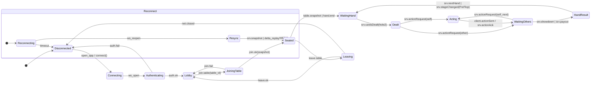
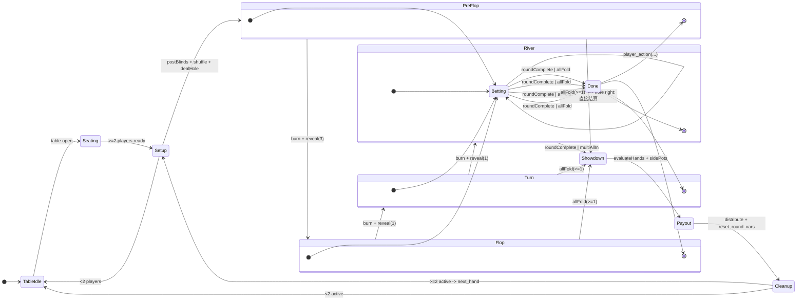
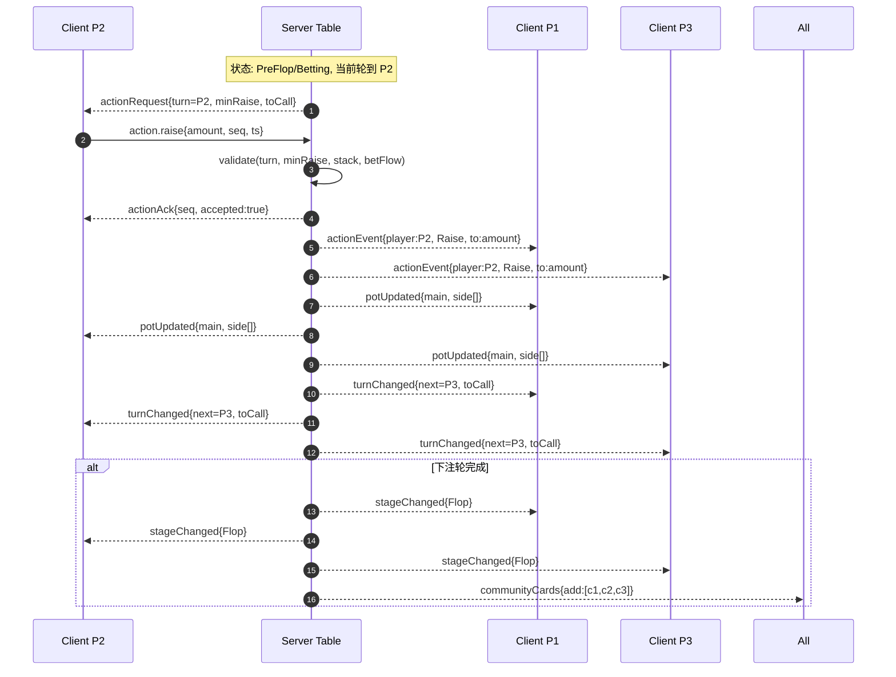

# 在线德州扑克 客户端与服务器状态转换图

下述状态命名与代码中的 GameStage 对齐：Setup → PreFlop → Flop → Turn → River → Showdown → Finished。

## 1) 客户端状态机（Client FSM）

要点：
- Reconnect 分区用于断线重连与状态回放（snapshot+增量事件）。
- Acting/WaitingOthers 交替直至下注轮完成或进入下一阶段。

---

## 2) 服务器（牌桌）状态机（Table/Game FSM）

要点：
- 每个街道都有 Betting 子状态，完成条件为“所有未全下玩家下注额相等且已行动，或只剩一名未弃牌玩家”。
- 任何街道出现 allFold 直接进入 Showdown/Payout（无需发完公共牌）。
- 支持边池（side pots）与多人 All-In。

---

## 3) 典型行动时序（Sequence：加注一例）

补充事件命名建议（简化版）：
- 服务器→客户端：table.snapshot, stage.changed, cards.dealt, community.revealed, action.request, action.event, action.ack, pot.updated, showdown, payout, turn.changed, error, heartbeat
- 客户端→服务器：join.table, leave.table, ready, action.fold/check/call/raise/allin, rebuy, sitout/return, heartbeat

---